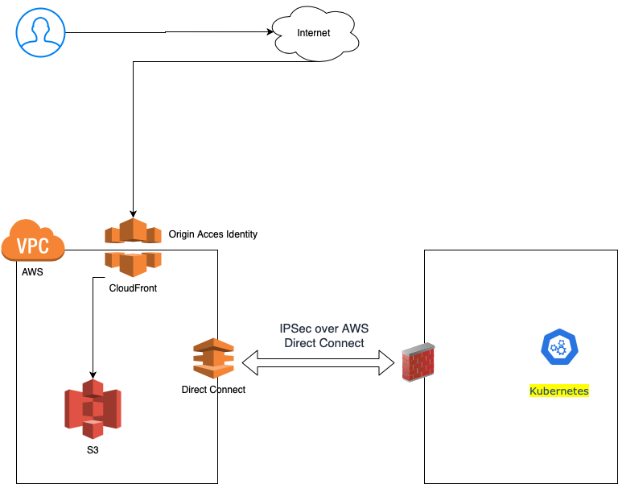

# How to Protect the S3 bucket
1. Data at Rest

   Setting defautl server-side encryption behavior for the Amazon S3 bucket 

   - Recommend to use SSE-KMS  and SSE-C, which have more granular control in key management service (KMS)

2. Data in Transit

   S3 bucket policies should only allow requests that use HTTPS. Add the following condition like this in S3 bucket policies

   ```
   "Condition": {
     "Bool": {
       "aws:SecureTransport": "true"
     }
   }
   ```

3. Ensure that your S3 buckets are not publicly accessible

4. Limit access to specific known IP address ranges i.e. Absolute Office IPswith bucket policies, and access point policies

   ```
   {
     "Id": "SourceIP",
     "Version": "2012-10-17",
     "Statement": [
       {
         "Sid": "SourceIP",
         "Action": "s3:*",
         "Effect": "Deny",
         "Resource": [
           "arn:aws:s3:::ABSOLUTE",
           "arn:aws:s3:::ABSOLUTE/*"
         ],
         "Condition": {
           "NotIpAddress": {
             "aws:SourceIp": [
               "11.11.11.11/32",
               "22.22.22.22/32"
             ]
           }
         },
         "Principal": "*"
       }
     ]
   }
   ```

5. Implement a "Least Privilege" access model to limit access to S3 resources by using a combination of IAM, bucket Policies and S3 Access Point

   - Only Allow read / write permission to a specific on-premises service e.g. Kubernetes 
   - Deny read / write / delete to other service by default

6. Restricting access to Amazon S3 content by using an Origin Access Identity (OAI)

   To restrict access to content that you serve from Amazon S3 buckets, follow these steps:.

   - Create a special CloudFront user called an origin access identity (OAI) and associate it with your distribution.
   - Configure your S3 bucket permissions so that CloudFront can use the OAI to access the files in your bucket and serve them to your users. Make sure that users can’t use a direct URL to the S3 bucket to access a file there.

   After you take these steps, users can only access your files through CloudFront, not directly from the S3 bucket.

# How to integrate with other services runnung in on-premise K8S and AWS

1. Data in transit

   You can use IPSec over AWS Direct Connect links for additional end-to-end protection. Normally,  It recommend to use Firewall to form IPsec VPN with AWS 


# How to provide access to development and deployment 

1. Provide Access key for IAM user to development and deployment tools 

   Instead of sharing the credentials of the AWS account root user, create individual IAM users, granting each user only the permissions they require

   Observe these precautions when using access keys:

   - **Don't embed access keys directly into code.**
   - **Rotate access keys periodically.**
   - **Remove unused access keys.**

2. Use IAM roles instead of long-term access keys

   In many scenarios, you don't need long-term access keys that never expire (as you have with an IAM user). Instead, you can create IAM roles and generate temporary security credentials. Temporary security credentials consist of an access key ID and a secret access key, but they also include a security token that indicates when the credentials expire.

   
